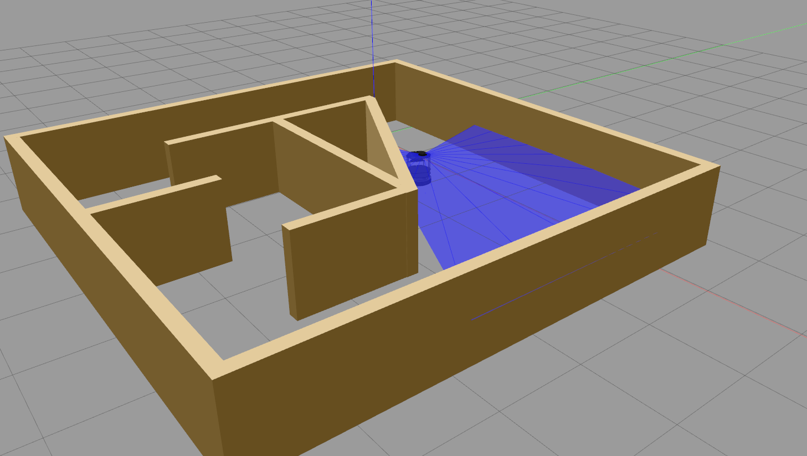
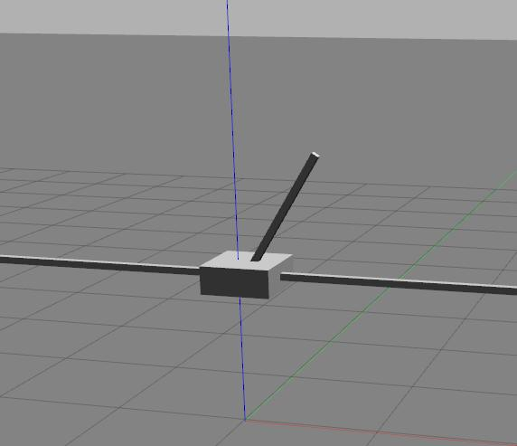
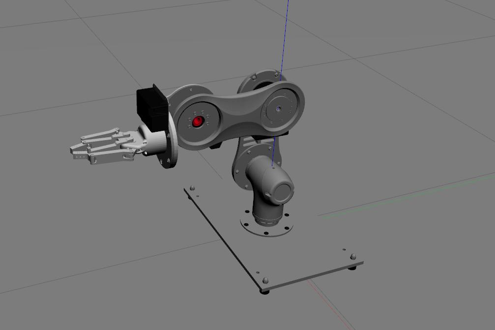
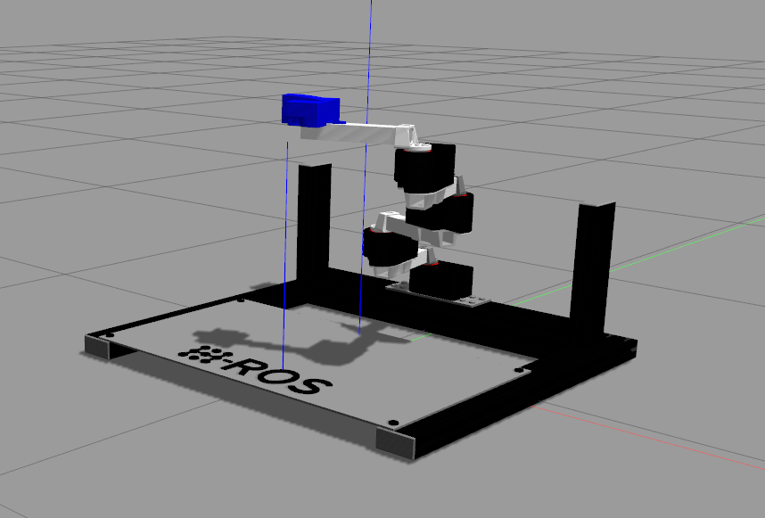
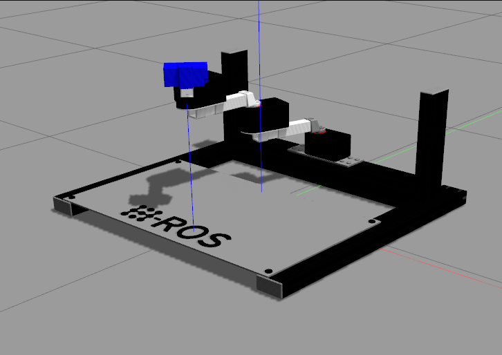
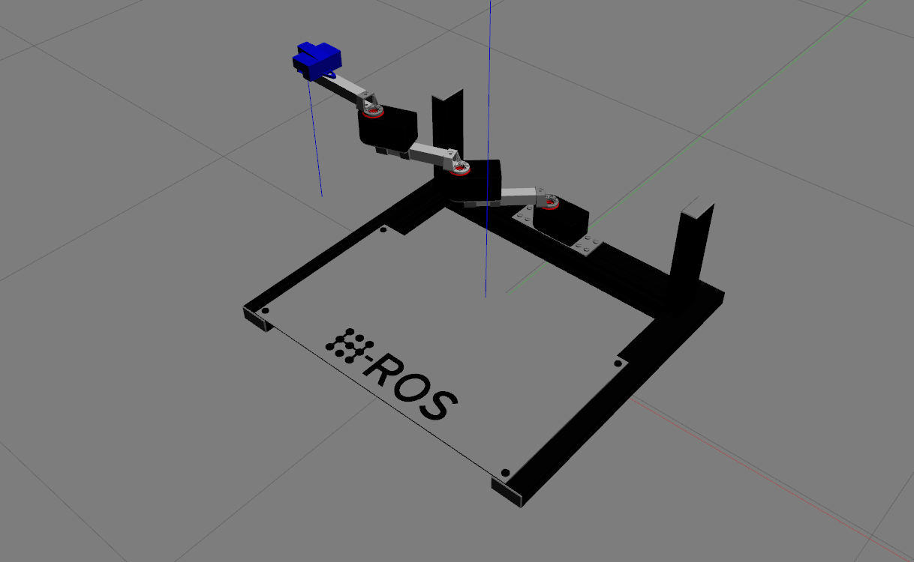
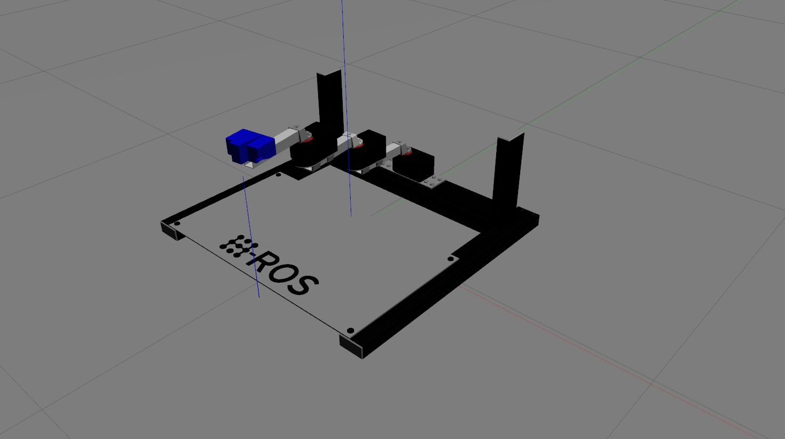
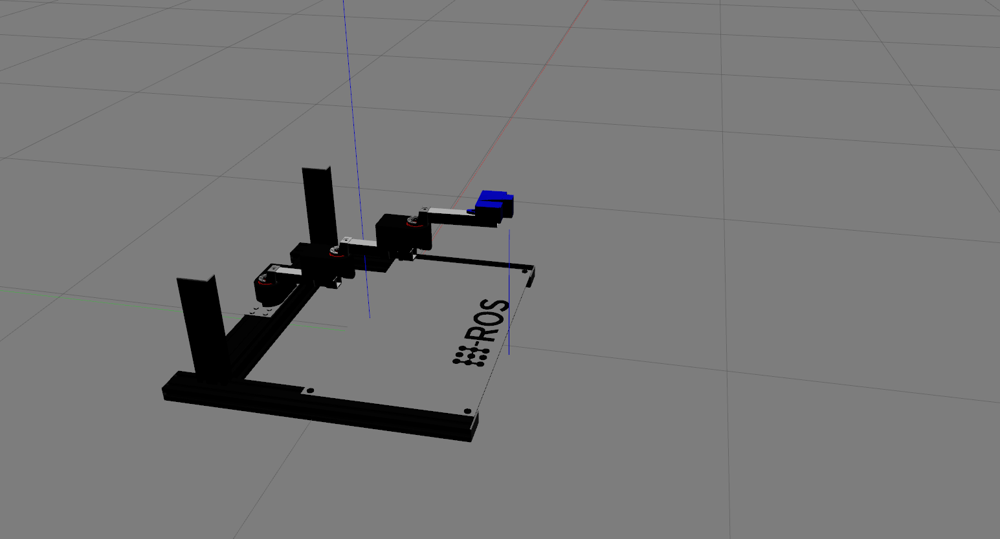
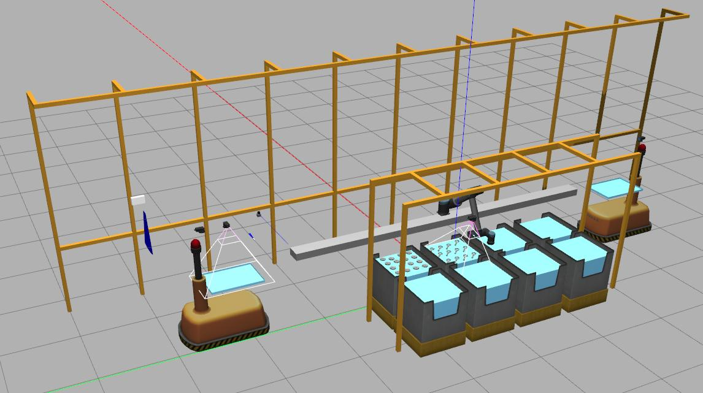

# Gym Gazebo

**An OpenAI gym extension for using Gazebo known as `gym-gazebo`**.

The are 3 repositories:

- [Erlerobot](https://github.com/erlerobot/gym-gazebo). Current version.
- [Acutronic](https://github.com/AcutronicRobotics/gym-gazebo2) using ROS2 (newer version).
- [The construct](https://www.theconstructsim.com/machine-learning-openai-gym-ros-development-studio-2/) + ROS for MachineLearning.

This work presents an extension of the initial OpenAI gym for robotics using ROS and Gazebo. A whitepaper about this work is available at https://arxiv.org/abs/1608.05742.

`gym-gazebo` is a complex piece of software for robotics that puts together simulation tools, robot middlewares (ROS, ROS 2), machine learning and reinforcement learning techniques. All together to create an environment where to benchmark and develop behaviors with robots. Setting up `gym-gazebo` appropriately requires relevant familiarity with these tools.

## Table of Contents

- [Installation](#installation)
- [Usage](#usage)
- [Environments](#community-maintained-environments)

## Installation

Installation over Ubuntu 18.04:

- ROS Melodic: Desktop-Full Install recommended, includes Gazebo 9.0.0 (http://wiki.ros.org/melodic/Installation/Ubuntu).
- Gazebo 9.0.0

### ROS Melodic related dependencies

```
sudo apt-get install                     \
python-pip python3-vcstool python3-pyqt4 \
pyqt5-dev-tools                          \
libbluetooth-dev libspnav-dev            \
pyqt4-dev-tools libcwiid-dev             \
cmake gcc g++ qt4-qmake libqt4-dev       \
libusb-dev libftdi-dev                   \
python3-defusedxml python3-vcstool       \
ros-melodic-octomap-msgs                 \
ros-melodic-joy                          \
ros-melodic-geodesy                      \
ros-melodic-octomap-ros                  \
ros-melodic-control-toolbox              \
ros-melodic-pluginlib	                 \
ros-melodic-trajectory-msgs              \
ros-melodic-control-msgs	         \
ros-melodic-std-srvs 	                 \
ros-melodic-nodelet	                 \
ros-melodic-urdf		         \
ros-melodic-rviz		         \
ros-melodic-kdl-conversions              \
ros-melodic-eigen-conversions            \
ros-melodic-tf2-sensor-msgs              \
ros-melodic-pcl-ros                      \
ros-melodic-navigation                   \
ros-melodic-sophus
```

### Create a virtualenv

```bash
virtualenv -p python3 gym-gazebo-env
```

Activate the virtual environment:

```bash
source gym-gazebo-env/bin/activate
```

### Install Python Packages:

```bash
pip install -r requirements
```

#### Install gym-gazebo

```bash
cd ~
git clone https://github.com/erlerobot/gym-gazebo
cd gym-gazebo
pip install -e .
```

#### Run bash files, build the ROS workspace:

```bash
cd gym-gazebo/gym_gazebo/envs/installation
bash setup_melodic.bash
```


## Usage

### Build and install gym-gazebo

In the root directory of the repository:

```bash
pip install -e .
```

### Running an environment

- Load the environment variables corresponding to the robot you want to launch. E.g. to load the Turtlebot:

```bash
cd gym_gazebo/envs/installation
bash turtlebot_setup.bash
```

Note: all the setup scripts are available in `gym_gazebo/envs/installation`

- Run any of the examples available in `examples/`. E.g.:

```bash
cd examples/turtlebot
python circuit2_turtlebot_lidar_qlearn.py
```

### Display the simulation

To see what's going on in Gazebo during a simulation, run gazebo client. In order to launch the `gzclient` and be able to connect it to the running `gzserver`:

1. Open a new terminal.
2. Source the corresponding setup script, which will update the _GAZEBO_MODEL_PATH_ variable: e.g. `source setup_turtlebot.bash`
3. Export the _GAZEBO_MASTER_URI_, provided by the [gazebo_env](https://github.com/erlerobot/gym-gazebo/blob/7c63c16532f0d8b9acf73663ba7a53f248021453/gym_gazebo/envs/gazebo_env.py#L33). You will see that variable printed at the beginning of every script execution. e.g. `export GAZEBO_MASTER_URI=http://localhost:13853`

**Note**: This instructions are needed now since `gazebo_env` creates a random port for the GAZEBO_MASTER_URI, which allows to run multiple instances of the simulation at the same time. You can remove the following two lines from the environment if you are not planning to launch multiple instances:

```bash
os.environ["ROS_MASTER_URI"] = "http://localhost:"+self.port
os.environ["GAZEBO_MASTER_URI"] = "http://localhost:"+self.port_gazebo
```

Finally, launch `gzclient`.

```bash
gzclient
```

### Display reward plot

Display a graph showing the current reward history by running the following script:

```bash
cd examples/utilities
python display_plot.py
```

HINT: use `--help` flag for more options.

### Killing background processes

Sometimes, after ending or killing the simulation `gzserver` and `rosmaster` stay on the background, make sure you end them before starting new tests.

We recommend creating an alias to kill those processes.

```bash
echo "alias killgazebogym='killall -9 rosout roslaunch rosmaster gzserver nodelet robot_state_publisher gzclient'" >> ~/.bashrc
```


## Community-maintained environments

The following are some of the gazebo environments maintained by the community using `gym-gazebo`.

| Name                                                         | Middleware                                         | Description                                                  | Reward range |
| ------------------------------------------------------------ | -------------------------------------------------- | ------------------------------------------------------------ | ------------ |
| `GazeboCircuit2TurtlebotLidar-v0` | ROS                                                | A simple circuit with straight tracks and 90 degree turns. Highly discretized LIDAR readings are used to train the Turtlebot. Scripts implementing **Q-learning** and **Sarsa** can be found in the _examples_ folder. |              |
| `GazeboCircuitTurtlebotLidar-v0.png` | ROS                                                | A more complex maze  with high contrast colors between the floor and the walls. Lidar is used as an input to train the robot for its navigation in the environment. | TBD          |
| `GazeboMazeErleRoverLidar-v0`                                | ROS, [APM](https://github.com/erlerobot/ardupilot) | **Deprecated**                                               |              |
| `GazeboErleCopterHover-v0`                                   | ROS, [APM](https://github.com/erlerobot/ardupilot) | **Deprecated**                                               |              |

## Other environments (no support provided for these environments)

The following table compiles a number of other environments that **do not have
community support**.

| Name                                                         | Middleware | Description                                                  | Observation Space | Action Space | Reward range                                                 |
| ------------------------------------------------------------ | ---------- | ------------------------------------------------------------ | ----------------- | ------------ | ------------------------------------------------------------ |
| `GazeboCartPole-v0`     | ROS        |                                                              | Discrete(4,)      | Discrete(2,) | 1) Pole Angle is more than ±12° 2)Cart Position is more than ±2.4 (center of the cart reaches the edge of the display) 3) Episode length is greater than 200 |
| `GazeboModularArticulatedArm4DOF-v1` | ROS        | This environment present a modular articulated arm robot with a two finger gripper at its end pointing towards the workspace of the robot. | Box(10,)          | Box(3,)      | (-1, 1) [`if rmse<5 mm 1 - rmse else reward=-rmse`]          |
| `GazeboModularScara4DOF-v3` | ROS        | This environment present a modular SCARA robot with a range finder at its end pointing towards the workspace of the robot. The goal of this environment is defined to reach the center of the "O" from the "H-ROS" logo within the workspace. This environment compared to `GazeboModularScara3DOF-v2` is not pausing the Gazebo simulation and is tested in algorithms that solve continuous action space (PPO1 and ACKTR from baselines).This environment uses `slowness=1` and matches the delay between actions/observations to this value (slowness). In other words, actions are taken at "1/slowness" rate. | Box(10,)          | Box(3,)      | (-1, 1) [`if rmse<5 mm 1 - rmse else reward=-rmse`]          |
| `GazeboModularScara3DOF-v3` | ROS        | This environment present a modular SCARA robot with a range finder at its end pointing towards the workspace of the robot. The goal of this environment is defined to reach the center of the "O" from the "H-ROS" logo within the workspace. This environment compared to `GazeboModularScara3DOF-v2` is not pausing the Gazebo simulation and is tested in algorithms that solve continuous action space (PPO1 and ACKTR from baselines).This environment uses `slowness=1` and matches the delay between actions/observations to this value (slowness). In other words, actions are taken at "1/slowness" rate. | Box(9,)           | Box(3,)      | (-1, 1) [`if rmse<5 mm 1 - rmse else reward=-rmse`]          |
| `GazeboModularScara3DOF-v2` | ROS        | This environment present a modular SCARA robot with a range finder at its end pointing towards the workspace of the robot. The goal of this environment is defined to reach the center of the "O" from the "H-ROS" logo within the workspace. Reset function is implemented in a way that gives the robot 1 second to reach the "initial position". | Box(9,)           | Box(3,)      | (0, 1) [1 - rmse]                                            |
| `GazeboModularScara3DOF-v1` | ROS        | **Deprecated**                                               |                   |              | TBD                                                          |
| `GazeboModularScara3DOF-v0` | ROS        | **Deprecated**                                               |                   |              |                                                              |
| `ARIACPick-v0`         | ROS        |                                                              |                   |              |                                                              |


## FAQ

Other possible libraries. Maybe these packages are necessary.

```bash
sudo apt install libosmesa6-dev
sudo apt install meshlab
sudo apt install libsdl1.2-dev
sudo apt-get install python3-empy
```
