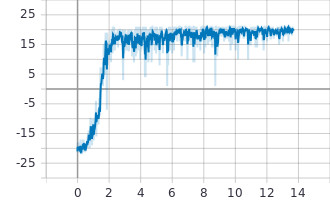
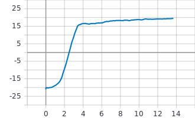
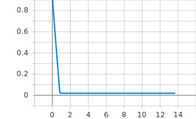
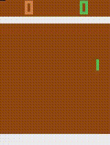

# Q-learning
## Value definition
Value as an expected total reward that is obtainable from the state. The total reward could be discounted or not.
Value is always calculated in the respect of some policy that our agent follows.

## Bellman equation
The optimal value of the state is equal to the action, which give us the maximun possible expected
immediate reward, plus discounted long-term reward for the next state. It is a recursive definition;
the value of the state is defined via the values of immediate reachable states.

## Value of action
We can define different quantities in addition to the value of state (v_s): value of action Q_s,a.
Basically, it equals the total reward we can get by executing action a in state s and can be defined 
via v_s.

Q for this state s and action a equals the espected inmmediate reward and the discounted long-term
reward of the destination state. We also can define v_s via Q_s,a. v_s = max(Q_s,a).

This just means that the value of some state equals to the value of the maximum action we can
execute from this state.

Q(s,a) = r_s,a + gamma max Q(s', a')

## The value iteration method
The procedure, for values of states, is:
1. Initialize values of all states Vi to some initial value.
2. For every state s performs the Bellman update.
3. Repeat step 2 for some large number of steps or until changes become too small.

For actions values (Q):
1. Initialize all Q_s,a to zero.
2. For every state s and every action a in this state, perform update.
3. Repeat step 2.

This method has several limitations:
1. Our state space should be discrete and small enough to perform multiple iterations over all states.
2. We rarely know the transition probability for the actions and reward matrix.

In the value iteration, we assume that we know all states in our environment in advance, can iterate
over them and can store value approximation associated with the state.

Other problem is the number of samples required to get good approximations for state transition dynamics.
For an environment with billion of states (frozenlake of size 31600x31600), to calculate even a rough
approximation for every state of this environment, we'll need hundreds of billions of transitions
evenly distributed over our states.

## Tabular Q-learning
Do we really need to iterate over every state in the state space? We have an environment that can be used
as a source of real-life sample of states. We can use states obtained from the environment to update 
values of states, which can save us lots of work.

This modification of the Value iteration is known as Q-learning, and for cases with explicit state-to-value
mappings, has the following steps:
1. Start with an empty table, mapping states to values of actions.
2. By interacting with the environment, obtain the tuple s, a, r, s' (state, action, reward and the new state).
3. Update the Q(s,a) value using the Bellman approximation. Q(s,a) = (1-alpha) Q(s,a) + alpha(reward + gamma max Q(s', a')).
4. Check convergence conditions. If not met, repeat from step 2.

# Deep Q-Network
The Q-learning method solves the issue with iteration over the full set of states, but still can
struggle with situations when the count of the observable set of states is very large.

## Interaction with the environment
The exploration versus exploitation dilemma, on the one hand, our agent needs to explore the environment
to build a complete picture of transitions and actions outcomes. On the other hand, we should use
interaction with the environment efficiently: we shouldn't waste time by randomly trying actions
we've already tried and have learned their outcomes.

A method which perfoms such a mix of two extreme behavious is known as epsilon-greedy method, which
just means switching between random and Q policy using the probability hyperparameter epsilon.

## SGB optimization
The core of our Q-learning procedure is borrowed from the supervised learning. Indeed, we are trying
to approximate a complex, nonlinear function Q(s,a) with a neural network. To do this, we calculate 
targets for this function using the Bellman equation and then pretend that we have a supervised learning
problem at hand. But one of the fundamental requirements for SGB optimization is that the training
data is independent and identically distributed (i.i.d).

In our case:
1. Our samples are not independent. Even if we accumulate a large batch of data samples, they all
will be very close to each other.
2. Distribution of our training data won't be identical to samples provided by the optimal policy
that we want to learn. Data that we have is a result of some other policy, but we don't want to learn
how to play randomly: we want an optimal policy with the best reward.

To deal with this nuisance, we usually need to use a large buffer of our past experience and sample
trainig data from it, instead of using our latest experience. This method is called replay buffer.
This method allow us to train more-or-less independent data, but data will still be fresh enough to 
train on samples generated by our recent policy.

## Correlation between steps
The Bellman equation provides us with the values of Q(s,a) via Q(s',a'). However, both states s and s'
have only one step between them. This make them very similar and it's really hard for neural network
to distinguish between them. When we perform an update of our networks parameters, to make Q(s,a) closer 
to the desired result, we indirectly can alter the value produced for Q(s',a') and other states nearby.
This can make our training really unstable.

To make training more stable, there is a trick, called target network, when we keep a copy of 
our network and use it for the Q(s', a') value in Bellman equation. This network is synchronized 
with our main network only periodically.

## The Markov property
Our RL methods use a MDP formalism as their basis, which assumes that the environment obeys the
Markov property: observations from the environment is all that we need to act optimally. One single image
from the Atari game (pong) is not enough to capture all important information (using only one image
we have no idea about the speed and direction of objects). This obviously violates the Markov property
and moves our single-frame Pong environment into the are of partially observable MDPs (POMDP).

We'll use a small technique to push our environment back into the MDP domain. The solution is maintaining
several observations from the past and using them as a state. In the case of Atari games, we usually 
stack k subsequent frames together and use them as the observation at every state. This allow to deduct
the dynamics of the current state, for instance, to get the speed of the ball and its direction.

## DQN training
1. Initialize parameters for Q(s,a) and target Q(s,a) with random weights, epsilon = 1.0, and empty replay buffer.
2. With probability epsilon, select a random action a, otherwise a = arg max Q_s,a.
3. Execute action a in an emulator and observe reward r and the next state s'.
4. Store transitions (s, a, r, s') in the replay buffer.
5. Sample a random minibatch of transitions from the replay buffer.
6. For every transition in the buffer, calculate target y=r if the episode has ended at this step
or y = r + gamma max target Q_s,a otherwise.
7. Calculate loss: l = (Q_s,a - y)^2.
8. Update Q(s,a) using the SBD algorithm by minimizing the loos in respect to model parameteres.
9. Every N steps copy weights from Q to target Q.
10. Repeat from step 2 until converged.

## DQN playing Pong and training results
An episode ends when a player reach 20 points.

Reward:

Average reward:

epsilon:

DQN playing Pong:

