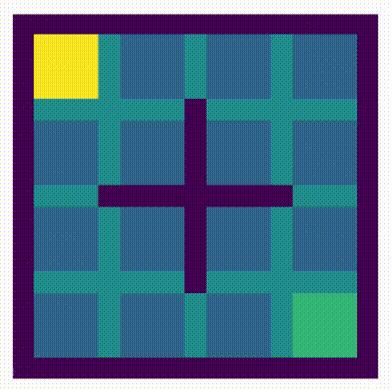

# Off-policy learning: Q learning
Is a very simple and widely used TD algorithm. In control algorithms, we don't care about state value; here, in Q learning, our concern is the state-action value pair (performs an action A in the state S).

We will update the Q value based on the following equation:

Q(s,a) = Q(s,a) + alpha (reward + gamma max Q(s', a) - Q(s,a))

The steps involved in Q learning are as follows:
1. We initialize the Q function to some arbitrary values.
2. We take an action from a state using epsilon-greedy policy (e > 0) and move it to the new state.
3. We update the Q value of a previous table state by following the previous rule.
4. We repeat the steps 2 and 3 till we reach the terminal state.

